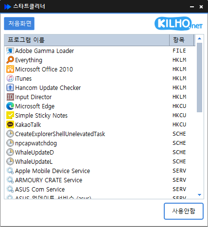

# 스타트클리너

**부팅할 때 자동으로 켜지는 프로그램 · 예약 작업 · 서비스를 한 화면에서 보고, 지우지 않고 꺼 두어 안전하게 정리하는 Windows 무료 시작 프로그램 관리 도구.**

[English](README.md) · 한국어 · [简体中文](README.zh-CN.md) · [日本語](README.ja.md) · [Español](README.es.md) · [Português (Brasil)](README.pt-BR.md) · [Français](README.fr.md)

-0078D4)

## 개요

컴퓨터를 켤 때마다 메신저, 업데이트 도우미, 각종 서비스가 저절로 함께 켜집니다. 하나씩은 작아도 쌓이면 부팅이 느려지고 메모리를 차지합니다.

스타트클리너는 이렇게 자동으로 켜지는 것들을 **시작폴더 · 레지스트리 · 예약작업 · 서비스** 네 곳에서 모아 한 목록으로 보여 줍니다. 필요 없는 항목을 골라 **사용안함** 을 누르면 다음 부팅부터 켜지지 않습니다. 항목을 지우는 것이 아니라 꺼 두는 것이므로, 나중에 **사용함** 한 번으로 그대로 되돌릴 수 있습니다.

Windows 가 꼭 필요로 하는 기본 항목은 목록에서 미리 숨겨 두어, 실수로 끄면 안 되는 것을 건드릴 일이 적습니다.

## 주요 기능

- **한 목록에서 관리** — 시작폴더, 레지스트리, 작업 스케줄러, 서비스에 흩어져 있는 자동 실행 항목을 한자리에서 봅니다.
- **지우지 않고 끄기** — **사용안함** 으로 꺼 두고, 언제든 **사용함** 으로 되돌립니다.
- **Windows 기본 항목 숨김** — 꺼서는 안 되는 Windows 구성 요소는 목록에 나오지 않습니다. 인터넷에 연결돼 있으면 숨길 항목 목록을 최신으로 받아 옵니다.
- **알아보기 쉬운 이름** — 파일 이름 대신 프로그램의 제품 이름과 아이콘으로 보여 줍니다.
- **완전히 삭제** — 더는 쓰지 않는 프로그램이 남긴 항목은 꺼 둔 뒤 목록에서 아예 지울 수 있습니다.
- **정보 찾기** — 무엇인지 모르는 항목은 더블클릭 한 번으로 웹에서 찾아봅니다.
- **목록 저장** — 지금 자동 실행 항목 전체를 텍스트 파일로 남깁니다.
- **다크 모드** — Windows 의 앱 모드(밝게 · 어둡게)를 따라 화면 색이 바뀝니다.
- **9개 언어** — 한국어 · 영어 · 일본어 · 중국어 · 러시아어 · 이탈리아어 · 프랑스어 · 스페인어 · 아랍어.

## 다운로드 / 설치

| 종류 | 링크 |
|---|---|
| 설치판 | [다운로드](https://down.kilho.net/startcleaner?lang=ko) |
| 무설치판 (ZIP) | [다운로드](https://down.kilho.net/startcleaner?lang=ko&nosetup) |

설치판은 설치가 끝나면 스타트클리너를 바로 실행합니다. 무설치판은 ZIP 을 풀고 `StartCleaner.exe` 를 실행하면 됩니다. 두 판의 기능은 같습니다.

자동 실행 항목을 바꾸려면 관리자 권한이 필요하므로, 실행할 때 Windows 가 관리자 권한 확인 창을 띄웁니다. **예** 를 누르면 됩니다.

## 사용법

### 처음 사용하기

1. 스타트클리너를 실행하고 관리자 권한 확인 창에서 **예** 를 누릅니다.
2. 부팅할 때 켜지는 항목이 **프로그램 이름** 과 **출처** 로 목록에 나옵니다.
3. 끄고 싶은 항목을 한 번 누르고, 아래쪽 **사용안함** 을 누릅니다.
4. 그 줄이 흐리게 바뀌고 버튼은 **사용함** 으로 바뀝니다. 다음에 Windows 를 켤 때부터 그 항목은 실행되지 않습니다.
5. 다시 켜고 싶으면 같은 줄을 누르고 **사용함** 을 누릅니다.

꺼 둔 항목은 바로 목록에서 사라지지 않고 흐린 채로 자리에 남아 있어, 방금 끈 것을 곧바로 되돌릴 수 있습니다.

### 화면 구성

| 요소 | 역할 |
|---|---|
| **처음화면** | 자동 실행 목록이 있는 화면 |
| KILHO.net 로고 | 스타트클리너 소개 페이지를 엽니다 |
| **프로그램 이름** 열 | 프로그램 아이콘과 이름 (제품 이름이 있으면 제품 이름) |
| **출처** 열 | 그 항목이 어디에 등록돼 있는지 — 아이콘과 이름 |
| 흐린 줄 | **사용안함** 상태인 항목 |
| **전체목록** | 체크하면 꺼 둔 항목까지 모두 보여 줍니다 |
| **사용안함** / **사용함** | 고른 항목을 끄거나 켭니다. 항목을 고르기 전에는 흐리게 표시됩니다 |
| 오른쪽 클릭 메뉴 | **삭제**(꺼 둔 항목만) · **목록 저장** |

**출처** — 어디서 켜지는 항목인지

| 출처 | 뜻 |
|---|---|
| **시작폴더** | 시작 메뉴의 "시작프로그램" 폴더에 들어 있는 바로 가기와 실행 파일 (모든 사용자 · 현재 사용자) |
| **레지스트리** | 프로그램이 설치될 때 "로그인하면 실행" 으로 등록해 둔 항목 |
| **예약작업** | 작업 스케줄러에 등록돼 정해진 때 실행되는 작업 (업데이트 확인 등) |
| **서비스** | Windows 가 시작될 때 자동으로 켜지는 백그라운드 서비스 |

### 이럴 때 이렇게

**컴퓨터를 켤 때 무엇이 같이 켜지는지 알고 싶을 때**
스타트클리너를 실행하기만 하면 됩니다. 네 곳에 흩어져 있는 자동 실행 항목이 한 목록에 모여 나오고, **출처** 열로 어디에 등록된 것인지 바로 알 수 있습니다. 프로그램을 새로 설치한 뒤라면 **F5** 로 목록을 다시 불러옵니다.

**메신저나 업데이트 도우미가 로그인할 때마다 켜지는 게 싫을 때**
목록에서 그 프로그램을 누르고 **사용안함** 을 누릅니다. 프로그램은 지워지지 않고 그대로 쓸 수 있으며, 다만 Windows 를 켤 때 저절로 실행되지 않습니다. 필요할 때 직접 실행하면 됩니다. **시작폴더** 와 **레지스트리** 항목은 작업 관리자의 **시작 앱** 탭에서도 똑같이 "사용 안 함" 으로 보입니다.

**꺼 둔 항목을 다시 켜고 싶을 때**
**전체목록** 을 체크하면 예전에 꺼 둔 항목이 흐린 줄로 함께 나옵니다. 그 줄을 누르고 **사용함** 을 누르면 다음 부팅부터 다시 실행됩니다.

**몰래 돌아가는 업데이트 예약 작업을 끄고 싶을 때**
**출처** 가 **예약작업** 인 줄이 작업 스케줄러에 등록된 작업입니다. 브라우저나 프로그램의 업데이트 확인이 여기에 많이 들어 있습니다. 끄고 싶은 작업을 골라 **사용안함** 을 누르면 그 작업은 정해진 때가 와도 실행되지 않습니다.

**필요 없는 서비스를 부팅 때 켜지지 않게 하고 싶을 때**
**서비스** 줄에서 **사용안함** 을 누르면 그 서비스는 Windows 가 시작될 때 켜지지 않고, 다른 프로그램이 불러도 켜지지 않습니다. **사용함** 을 누르면 Windows 가 시작될 때 자동으로 켜지도록 바뀝니다. 서비스는 어떤 프로그램이 쓰는 것인지 확인하고 끄는 것이 좋습니다 — 모르는 서비스는 아래처럼 먼저 알아보세요.

**이 항목이 무엇인지 모를 때**
목록에서 그 줄을 더블클릭하면 브라우저가 열리고 그 항목에 대한 정보를 찾아 보여 줍니다. 끄기 전에 무엇을 하는 프로그램인지 확인할 때 씁니다.

**지운 프로그램의 자동 실행 항목이 남아 있을 때**
프로그램을 제거했는데도 목록에 이름이 남아 있다면, 먼저 그 줄을 **사용안함** 으로 바꾼 뒤 오른쪽 클릭 → **삭제** 를 누릅니다. 확인 창에서 **예** 를 누르면 그 항목이 목록에서 완전히 지워집니다. 삭제한 항목은 되돌릴 수 없으므로, 확실히 필요 없는 것만 지우세요. 켜져 있는 항목에는 **삭제** 메뉴가 나오지 않습니다 — 먼저 꺼 두고 며칠 써 본 뒤 지우면 안전합니다.

**서비스를 완전히 지우고 싶을 때**
서비스는 **사용안함** 으로 바꾼 것만 **삭제** 할 수 있습니다. 실행 중이던 서비스는 멈춘 뒤 지웁니다. 지우고 나면 "실행 중이던 서비스는 재부팅 후 완전히 제거됩니다" 라는 안내가 뜨는데, 컴퓨터를 한 번 다시 시작하면 깨끗이 정리됩니다.

**전체목록에서 흐리게 보이는 서비스**
**전체목록** 에는 필요할 때만 켜지도록 설정된 서비스도 흐린 줄로 나옵니다. 이런 서비스에 **사용함** 을 누르면 Windows 를 켤 때마다 자동으로 켜지게 되므로, 직접 꺼 둔 것이 아니라면 그대로 두세요.

**정리하기 전에 지금 상태를 남겨 두고 싶을 때**
목록에서 오른쪽 클릭 → **목록 저장** 을 누르고 저장할 곳을 고릅니다. 목록에 보이지 않는 Windows 기본 항목까지 포함한 자동 실행 항목 전체가 텍스트 파일로 저장됩니다. 정리 전후를 비교하거나, 다른 PC 와 견주어 볼 때 쓸 수 있습니다.

**Windows 기본 항목이 목록에 없는 이유**
오디오, 네트워크, 보안처럼 Windows 가 동작하는 데 꼭 필요한 서비스와 작업은 처음부터 목록에서 숨깁니다. 꺼 두면 Windows 가 제대로 돌지 않을 수 있는 것들이라, 스타트클리너에서는 아예 건드릴 수 없게 했습니다. **전체목록** 을 체크해도 이 항목들은 나오지 않습니다.

**키보드로 목록 살펴보기**
**↑** · **↓** 로 줄을 옮겨 가며 고를 수 있고, 고른 줄이 늘 보이도록 목록이 따라 움직입니다. **F5** 는 목록을 새로 불러옵니다.

**이름이 길어 잘려 보일 때**
창 가장자리를 끌어 창을 넓히면 **프로그램 이름** 열이 함께 넓어집니다. 열 제목 사이 경계를 끌어 열 폭을 직접 맞출 수도 있습니다.

**이미 실행 중인데 또 실행했을 때**
스타트클리너는 하나만 실행됩니다. 창이 열려 있는 상태에서 다시 실행하면 새로 켜지지 않고, 이미 열린 창이 앞으로 나옵니다(최소화돼 있었으면 다시 펼쳐집니다).

## 설정

따로 설정할 것이 없습니다. 아래는 스타트클리너가 알아서 따릅니다.

| 항목 | 따르는 것 |
|---|---|
| 언어 | Windows 지역 설정 (지원하지 않는 언어면 영어) |
| 화면 색 | Windows 앱 모드 (밝게 · 어둡게) — 스타트클리너가 켜져 있는 동안 바꿔도 바로 따라갑니다 |

## 요구 사항

- Windows 10 · Windows 11 (64비트)
- 관리자 권한 — 자동 실행 항목을 바꾸려면 필요합니다. 실행할 때 확인 창이 뜹니다.
- 따로 설치할 구성 요소는 없습니다.
- 인터넷 연결은 새 버전 안내와 숨길 Windows 기본 항목 목록을 받아 오는 데만 씁니다. 연결이 없어도 내장된 목록으로 그대로 동작합니다.

## 업데이트

스타트클리너는 스스로 업데이트하지 **않습니다**. 실행할 때 새 버전이 있는지 확인해 안내 창을 띄우고, **[예]** 를 누르면 다운로드 페이지를 열고 프로그램을 닫습니다. 새 버전은 내부 검증을 거쳐 수동으로 배포되며 [스타트클리너 페이지](https://kilho.net/startcleaner)에 공지됩니다. [업데이트 정책 안내](https://kilho.net/archives/notice/2940)를 참고하세요.

**버전 이력**

| 버전 | 날짜 | 내용 |
|---|---|---|
| 2.0.0 | 2026-10-01 | Rust 로 새로 만들어 더 쾌적하고 안정적으로, 시작 프로그램과 서비스를 한곳에서 쉽고 빠르게 관리, 목록과 사용 흐름 개선 |
| 1.1.2 | 2026-09-22 | 삭제 전 상태를 다시 확인해 실수로 지우는 일 방지, 업데이트 정보 불러오기 안정성 향상 |
| 1.1.1 | 2026-07-20 | 시작 프로그램과 남은 흔적까지 한 번에 삭제, 삭제 전 확인과 안전장치 강화, 삭제한 항목이 목록에 다시 나타나지 않게 개선 |
| 1.1.0 | 2026-04-30 | 시작 프로그램 목록 표시 속도 대폭 향상, 반응 속도 향상, 작업 스케줄러 불러오기 속도 개선, 전반적인 안정성 강화 |

## 라이선스

스타트클리너는 **프리웨어**입니다. 회사, 집, 관공서, 학교 등 어디서나 제약 없이 무료로 쓸 수 있고, 자유롭게 재배포할 수 있습니다.

## 링크

- 웹사이트: <https://kilho.net/startcleaner>
- 포럼: <https://kilho.top/forum/qna>
- X (Twitter): <https://www.twitter.com/kilhonet>

© KILHO.NET
