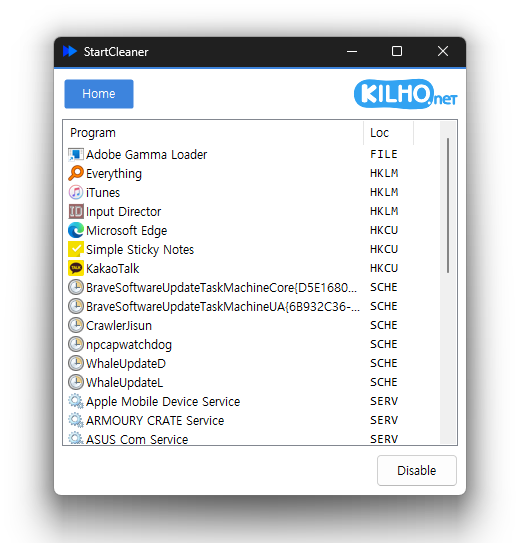

# StartCleaner

**Gerenciador de inicialização gratuito para Windows: mostra em uma única tela os programas, tarefas agendadas e serviços que iniciam com o computador e os organiza com segurança, desativando em vez de apagar.**

[English](README.md) · [한국어](README.ko.md) · [简体中文](README.zh-CN.md) · [日本語](README.ja.md) · [Español](README.es.md) · Português (Brasil) · [Français](README.fr.md)

> Este documento é uma tradução. Em caso de divergência, a [versão em coreano](README.ko.md) prevalece.

-0078D4)

> A interface do programa não tem tradução para português; ela é exibida em inglês. Os nomes de botões e opções abaixo aparecem como na tela.

## Visão geral

Toda vez que você liga o PC, mensageiros, assistentes de atualização e todo tipo de serviço iniciam junto. Cada um é pequeno, mas somados deixam a inicialização mais lenta e ocupam memória.

O StartCleaner reúne tudo o que inicia automaticamente a partir de quatro lugares — pastas de inicialização (**Startup**), **Registry**, tarefas agendadas (**Task**) e serviços (**Service**) — e mostra tudo em uma única lista. Selecione um item de que você não precisa e clique em **Disable**: a partir da próxima inicialização ele não será mais aberto. Nada é apagado, apenas desligado, então um clique em **Enable** traz tudo de volta exatamente como estava.

Os componentes de que o Windows realmente precisa já ficam ocultos na lista, então é difícil desativar por engano algo que não deveria.

## Principais recursos

- **Tudo em uma lista** — Veja em um só lugar os itens de inicialização automática espalhados por pastas de inicialização, registro, Agendador de Tarefas e serviços.
- **Desativar em vez de apagar** — Desligue com **Disable** e traga de volta quando quiser com **Enable**.
- **Itens essenciais do Windows ocultos** — Componentes do Windows que não devem ser desativados não aparecem na lista. Com conexão à internet, ele baixa a lista mais recente de itens a ocultar.
- **Nomes fáceis de reconhecer** — Mostra o nome do produto e o ícone de cada programa em vez do nome do arquivo.
- **Excluir de vez** — Entradas deixadas por programas que você não usa mais podem ser desativadas e depois removidas da lista por completo.
- **Pesquisar** — Dê um clique duplo em um item que você não conhece para pesquisá-lo na web.
- **Salvar a lista** — Salva todos os itens de inicialização atuais em um arquivo de texto.
- **Modo escuro** — As cores seguem o modo de aplicativo do Windows (claro · escuro).
- **9 idiomas** — Coreano · inglês · japonês · chinês · russo · italiano · francês · espanhol · árabe.

## Download / Instalação

| Tipo | Link |
|---|---|
| Instalador | [Download](https://down.kilho.net/startcleaner?lang=pt) |
| Portátil (ZIP) | [Download](https://down.kilho.net/startcleaner?lang=pt&nosetup) |

O instalador abre o StartCleaner assim que a instalação termina. Na versão portátil, descompacte o ZIP e execute `StartCleaner.exe`. As duas versões têm os mesmos recursos.

Alterar itens de inicialização automática exige permissões de administrador, por isso o Windows mostra uma janela de confirmação de administrador ao executá-lo. Clique em **Sim**.

## Como usar

### Primeiros passos

1. Execute o StartCleaner e clique em **Sim** na janela de confirmação de administrador.
2. Os itens que iniciam com o computador aparecem na lista com o nome em **Program** e a origem em **Source**.
3. Clique uma vez no item que você quer desligar e clique em **Disable**, embaixo.
4. A linha fica cinza e o botão muda para **Enable**. A partir da próxima vez que o Windows iniciar, esse item não será executado.
5. Para ligá-lo de novo, clique na mesma linha e clique em **Enable**.

Os itens desativados não somem da lista na hora: ficam no mesmo lugar, em cinza, para você poder desfazer imediatamente o que acabou de fazer.

### Organização da tela

| Elemento | Função |
|---|---|
| **Home** | A tela com a lista de inicialização automática |
| Logotipo KILHO.net | Abre a página do StartCleaner |
| Coluna **Program** | Ícone e nome do programa (o nome do produto, quando houver) |
| Coluna **Source** | Onde o item está registrado — um ícone e um nome |
| Linha cinza | Um item desativado |
| **All Programs** | Quando marcada, mostra tudo, inclusive os itens desativados |
| **Disable** / **Enable** | Desliga ou liga o item selecionado. Fica em cinza até você selecionar um item |
| Menu do botão direito | **Delete** (somente itens desativados) · **Save List** |

**Source** — de onde cada item inicia

| Source | Significado |
|---|---|
| **Startup** | Atalhos e programas da pasta "Inicializar" do menu Iniciar (todos os usuários · usuário atual) |
| **Registry** | Itens que um programa registrou para "executar ao entrar" durante a instalação |
| **Task** | Tarefas registradas no Agendador de Tarefas que rodam em horários definidos (verificação de atualizações etc.) |
| **Service** | Serviços em segundo plano que iniciam automaticamente com o Windows |

### O que fazer quando…

**Você quer saber o que inicia junto com o PC**
Basta executar o StartCleaner. Os itens de inicialização automática espalhados em quatro lugares são reunidos em uma lista, e a coluna **Source** mostra onde cada um está registrado. Se você acabou de instalar um programa, pressione **F5** para recarregar a lista.

**Você não quer que o mensageiro ou um assistente de atualização abra toda vez que você entra no Windows**
Clique nesse programa na lista e clique em **Disable**. O programa não é removido e continua funcionando normalmente; só deixa de abrir sozinho quando o Windows inicia. Abra-o você mesmo quando precisar. Itens de **Startup** e **Registry** também aparecem como "Desabilitado" na guia **Aplicativos de inicialização** do Gerenciador de Tarefas.

**Você quer ligar de novo um item desativado**
Marque **All Programs** e os itens que você desativou antes aparecem como linhas cinza. Clique na linha e clique em **Enable**: ele volta a ser executado a partir da próxima inicialização.

**Você quer desligar tarefas de atualização que rodam em segundo plano**
As linhas cuja **Source** é **Task** são tarefas registradas no Agendador de Tarefas. Muitas verificações de atualização de navegadores e programas ficam aqui. Selecione a tarefa que você quer parar e clique em **Disable**: ela não será executada mesmo quando chegar o horário agendado.

**Você quer que um serviço desnecessário não inicie com o computador**
Clicar em **Disable** em uma linha de **Service** impede que esse serviço inicie com o Windows — e outros programas também não conseguem iniciá-lo. Clicar em **Enable** faz com que ele passe a iniciar automaticamente com o Windows. É melhor verificar a qual programa um serviço pertence antes de desligá-lo — pesquise primeiro qualquer serviço que você não conheça, como explicado abaixo.

**Você não sabe o que é um item**
Dê um clique duplo na linha e o navegador abre com informações sobre esse item. Use isso para conferir o que um programa faz antes de desligá-lo.

**Sobraram entradas de inicialização de um programa que você desinstalou**
Se o programa já foi removido mas o nome continua na lista, primeiro mude a linha para **Disable** e depois clique com o botão direito → **Delete**. Clique em **Sim** na confirmação e o item é removido da lista por completo. Itens excluídos não podem ser recuperados, então exclua apenas o que você tem certeza de que não precisa. O menu **Delete** não aparece para itens que ainda estão ativos — o jeito seguro é desativar primeiro, usar o PC por alguns dias e só depois excluir.

**Você quer remover um serviço por completo**
Só é possível usar **Delete** em serviços que foram mudados para **Disable**. Um serviço em execução é parado antes de ser excluído. Depois aparece o aviso "A service that was running is fully removed after a restart" — reinicie o PC uma vez e ele some de vez.

**Serviços em cinza em All Programs**
**All Programs** também mostra, em linhas cinza, serviços configurados para iniciar só quando necessário. Clicar em **Enable** em um deles faz com que ele inicie automaticamente toda vez que o Windows iniciar, então deixe-os como estão, a menos que você mesmo os tenha desativado.

**Você quer registrar o estado atual antes de fazer a limpeza**
Clique com o botão direito na lista → **Save List** e escolha onde salvar. Todos os itens de inicialização automática — inclusive os itens essenciais do Windows ocultos na lista — são salvos em um arquivo de texto. Serve para comparar o antes e o depois, ou para comparar com outro PC.

**Por que os itens essenciais do Windows não aparecem na lista**
Serviços e tarefas de que o Windows precisa para funcionar — áudio, rede, segurança e assim por diante — ficam ocultos na lista desde o início. Desativá-los poderia impedir o Windows de funcionar direito, por isso o StartCleaner nem deixa você mexer neles. Eles continuam ocultos mesmo com **All Programs** marcada.

**Navegar pela lista com o teclado**
Use **↑** · **↓** para passar de uma linha a outra; a lista rola junto para que a linha selecionada fique sempre visível. **F5** recarrega a lista.

**Nomes cortados por serem longos demais**
Arraste a borda da janela para alargá-la e a coluna **Program** se alarga junto. Você também pode arrastar a divisa entre os cabeçalhos das colunas para ajustar a largura você mesmo.

**Executar de novo quando já está aberto**
Só um StartCleaner roda por vez. Executá-lo de novo com a janela aberta não abre uma nova cópia; a janela que já está aberta vem para a frente (e é restaurada, se estava minimizada).

## Configuração

Não há nada a configurar. O StartCleaner segue sozinho o seguinte:

| Item | Segue |
|---|---|
| Idioma | A configuração regional do Windows (inglês se o idioma não for suportado — é o caso do português) |
| Cores | O modo de aplicativo do Windows (claro · escuro) — mudanças são aplicadas na hora, mesmo com o StartCleaner aberto |

## Requisitos

- Windows 10 · Windows 11 (64 bits)
- Permissões de administrador — necessárias para alterar itens de inicialização automática. Uma janela de confirmação aparece ao executá-lo.
- Nenhum outro componente precisa ser instalado.
- A conexão à internet é usada apenas para avisos de novas versões e para baixar a lista de itens essenciais do Windows a ocultar. Sem conexão, ele funciona normalmente com a lista embutida.

## Atualizações

O StartCleaner **não** se atualiza sozinho. Ao iniciar, ele verifica se há uma nova versão e mostra um aviso; clicar em **[Sim]** abre a página de download e fecha o programa. Novas versões são lançadas manualmente após verificação interna e anunciadas na [página do StartCleaner](https://kilho.net/startcleaner). Consulte o [aviso sobre a política de atualizações](https://en.kilho.net/archives/notice/2940).

**Histórico de versões**

| Versão | Data | Alterações |
|---|---|---|
| 2.0.0 | 2026-10-01 | Refeito em Rust para um uso mais fluido e estável, gerenciamento rápido de programas de inicialização e serviços em um só lugar, listas e fluxo de uso aprimorados |
| 1.1.2 | 2026-09-22 | Verifica de novo o estado antes de excluir para evitar exclusões acidentais, carregamento mais confiável das informações de atualização |
| 1.1.1 | 2026-07-20 | Remove de uma vez os programas de inicialização junto com seus vestígios, confirmação e proteções reforçadas antes de excluir, itens removidos não reaparecem mais na lista |
| 1.1.0 | 2026-04-30 | Lista de programas de inicialização muito mais rápida, melhor resposta, carregamento mais rápido do Agendador de Tarefas, mais estabilidade geral |

## Licença

O StartCleaner é **freeware**. Use-o de graça e sem restrições em qualquer lugar — no trabalho, em casa, em órgãos públicos ou na escola — e redistribua-o livremente.

## Links

- Site: <https://kilho.net/startcleaner>
- Fórum: <https://kilho.top/forum/qna>
- X (Twitter): <https://www.twitter.com/kilhonet>

© KILHO.NET
